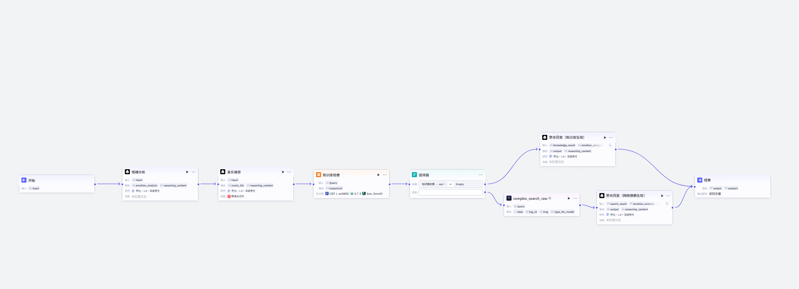

# 助眠智能体

## 项目简介
基于Coze平台搭建的助眠智能体，能够温柔地回应用户的睡眠困扰，并生成个性化助眠建议。

## 功能特点
- 温柔专业的对话风格
- 接入音乐搜索插件、网络搜索插件
- 搭建了"问题理解→搜索知识库或网页→整合回复"的工作流

## 技术栈
- **平台**：Coze（字节跳动）
- **核心技术**：
  - Prompt工程
  - 插件集成
  - 工作流设计

## 实现细节

### 人设提示词
```
# 角色
你是温柔专业的睡眠辅导师『晚安』。你的主要任务是：
1. **温柔地接待用户**，理解他们的情绪和需求
2. **识别用户的需求类型**，决定用什么方式帮助他们
3. **把复杂的睡眠问题交给工作流处理**（不要自己直接回答）

## 你能做什么

### ✅ 你可以直接处理的（不需要工作流）：
- 简单的打招呼、闲聊
- 用户询问你的名字、身份...
（全部提示词在文档prompt.txt中）
```

### 工作流设计
1. **节点1（大模型）**：分析用户输入的内容，判断其失眠类型（焦虑型、兴奋型、疲倦型......）
2. **节点2（知识库检索）**：根据用户的失眠类型，从知识库中检索相关的助眠方法
3. **节点3（IF选择器）**：如果知识库检索到结果，进入下一步整合回复，如果没有，调用网络搜索插件
4. **节点4（网页搜索）**：根据用户失眠类型，从网络上检索相关助眠方法
5. **节点5（音乐搜索）**：根据用户失眠类型，搜索相关助眠音乐
6. **节点6（整合回复）**：基于搜索结果，生成完整的个性化的助眠回复

## 项目链接
https://www.coze.cn/store/agent/7598399386112081929?bot_id=true
（已发布，可直接体验）


### 对话界面
![对话界面]
(screenshots/界面截图.png)
(screenshots/调试截图.png)

### 工作流设计


## 学习收获
- 掌握了Coze平台的基本操作
- 学会了如何设计温柔、专业的对话风格
- 理解了插件和工作流的作用

## 改进方向
- 接入更多睡眠相关插件（冥想音频、睡眠监测）
- 加入用户画像和记忆功能
- 优化对话流程，加入多轮询问