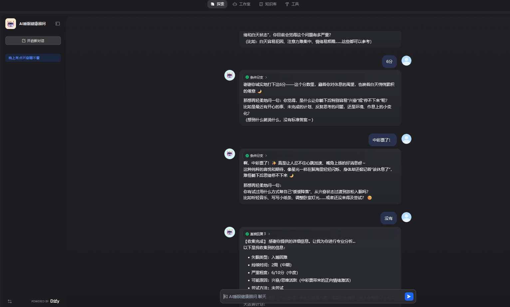
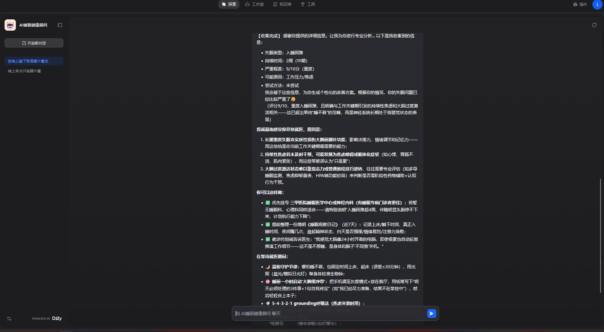
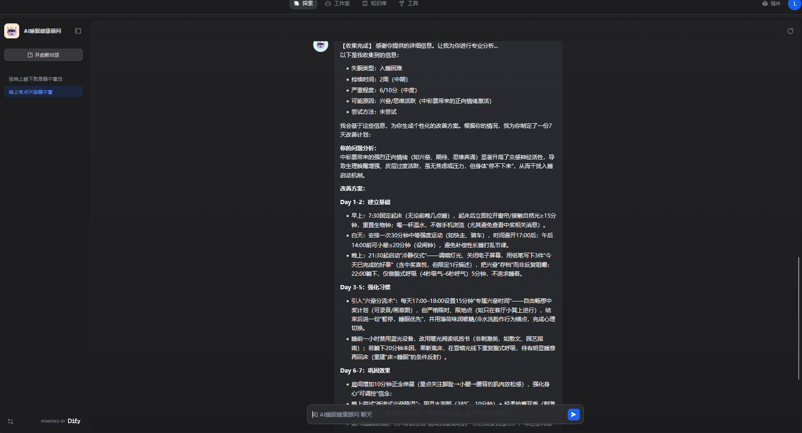
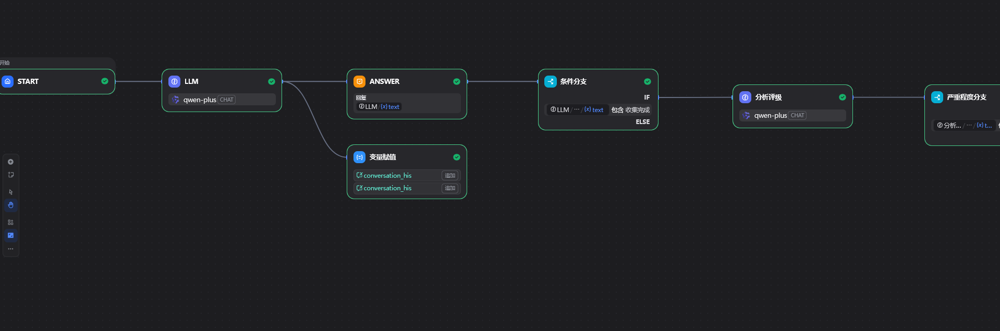
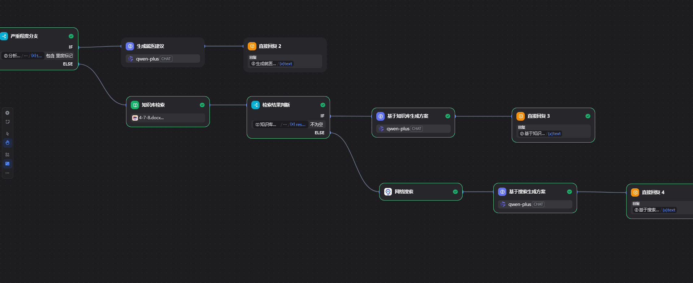

# AI睡眠健康顾问 - Dify版

基于Dify平台搭建的睡眠健康管理系统，采用多轮对话+知识库RAG+降级策略的完整技术方案。

## 🌟 项目亮点

- **多轮对话问诊**：渐进式收集用户信息，模拟真实医生问诊流程
- **智能严重度评估**：自动判断失眠程度，8分以上建议就医
- **三级降级策略**：RAG优先 → 网络搜索兜底，确保总有回答
- **知识库RAG**：基于睡眠医学文档的向量检索
- **个性化方案**：生成7天改善计划，可执行性强

## 🔧 技术栈

| 技术 | 用途 |
|------|------|
| **Dify** | AI应用开发平台 |
| **Chatflow** | 可视化工作流编排 |
| **Qdrant** | 向量数据库（Dify内置） |
| **通义千问** | 大语言模型 |
| **baidu** | 搜索工具（降级策略） |

## 📊 工作流设计

### 整体流程
```
用户输入
  ↓
信息收集（多轮对话）
  ↓
严重度评估
  ├─ 重度(≥8分) → 就医建议
  └─ 轻中度(<8分) → 方案生成
                      ├─ RAG检索成功 → 基于知识库
                      └─ RAG检索失败 → 网络搜索
```

### 核心节点

**1. 信息收集LLM**
- 逐步追问5项必要信息
- 包含【收集完成】标记

**2. 分析评级LLM**
- 提取失眠类型
- 评估1-10分
- 输出[重度标记]或[轻中度标记]

**3. 条件分支**
- 判断是否收集完成
- 判断严重程度
- 判断RAG检索结果

**4. 知识库检索**
- 混合检索
- TopK=5
- 阈值=0.5

**5. 降级策略**
- 有检索结果 → 基于RAG生成
- 无检索结果 → 搜索工具 → 基于搜索生成

## 📸 项目截图

### 信息收集阶段


### 评估结果 - 重度


### 改善方案生成


### 工作流全景



## 🚀 在线体验

**体验地址：** [点击查看演示视频→](演示视频.mp4)


**使用说明：**
1. 点击链接打开对话界面
2. 描述你的睡眠问题
3. 根据AI提问逐步回答
4. 获得个性化改善方案

## 💡 技术亮点

### 1. 多轮对话设计

采用渐进式问诊策略，而非一次性表单：
```
用户："我睡不好"
AI："具体是什么症状？"
用户："躺下1小时才能睡"
AI："持续多久了？"
用户："2个月"
AI："影响程度1-10分，打几分？"
```

**优势：**
- 用户体验更自然
- 信息收集更完整
- 模拟真实医患对话


### 2. 父子分段、混合检索组合

```
将普通分段模式改为父子分段，
纠正了文档中技术讲解段落语义不丰富的缺陷，
结合混合检索+rerank重排序，提高知识库召回率
```

### 3. Prompt工程

**信息收集Prompt特点：**
- 定义5项必要信息
- 强调同理心语气
- 输出【收集完成】标记
- 一次只问1-2个问题

**评级Prompt特点：**
- 严格输出格式
- 包含[重度标记]便于条件判断
- 温度0.3（严谨）

**方案生成Prompt特点：**
- 7天结构化计划
- 早中晚时段划分
- 可执行的具体行动
- 温度0.7（创意）


## 🔍 技术细节

### 节点配置示例

**信息收集LLM节点：**
```
模型：qwen-plus
温度：0.7（自然对话）
输出：包含【收集完成】标记
```

**条件分支节点：**
```
判断变量：{{#分析评级.text#}}
条件类型：包含
匹配值：[重度标记]
```

### 数据流示例
```
用户输入："我工作压力大，晚上睡不着"
  ↓
LLM输出："能具体说说吗？躺下后多久能睡着？"
  ↓
用户输入："至少1小时，已经2个月了"
  ↓
LLM输出："影响程度打几分？"
  ↓
用户输入："7分"
  ↓
LLM输出：【收集完成】... [轻中度标记]
  ↓
条件分支判断：不包含[重度标记] → 轻中度路径
  ↓
知识库检索："入睡困难 工作压力 改善方法"
  ↓
检索结果：2条文档
  ↓
条件分支判断：检索结果不为空 → RAG路径
  ↓
LLM生成方案：基于检索内容 + 7天计划
  ↓
输出给用户
```


## 🎯 项目收获

**技术方面：**
- 掌握了Dify平台的工作流编排
- 理解了向量数据库的检索原理
- 实践了Prompt工程的最佳实践

**产品方面：**
- 用户体验设计（多轮对话 vs 一次性表单）
- 系统稳定性设计（降级策略）

