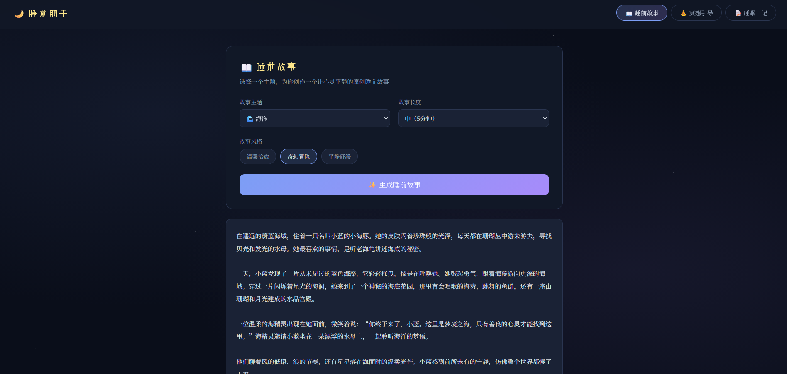

# 睡前内容生成器（Web应用）

## 项目简介
使用vue、Fastapi、通义千问API制作的助眠web应用Demo（已上云）
[访问链接](http://43.99.30.193/)

## 功能特点
- 睡前故事生成
- 冥想引导（带语音）
- 睡眠日记模板

## 技术栈
- **平台**：阿里云轻量应用服务器
- **核心技术**：
  - vue 
  - fastapi
  - 通义千问API

## 实现细节

### 完整代码
[代码](./code/)

## 项目截图

### 对话界面

[冥想引导功能测试](冥想引导截图.png)
[睡眠日记功能测试](睡眠日记截图.png)

## 改进方向
- 界面优化
- 语音增加语音角色，语速音量调整
- 生成催眠视频